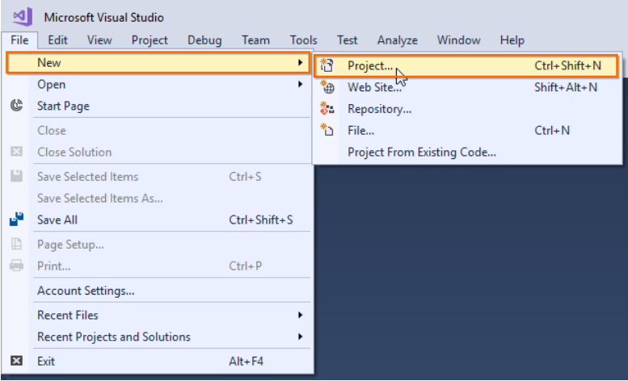
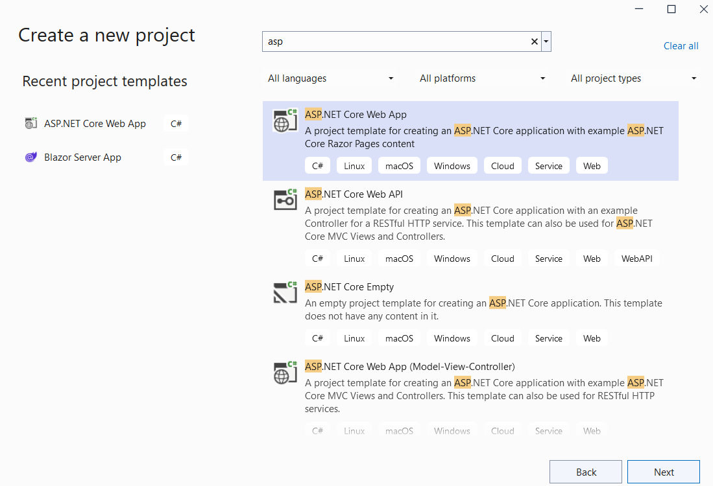
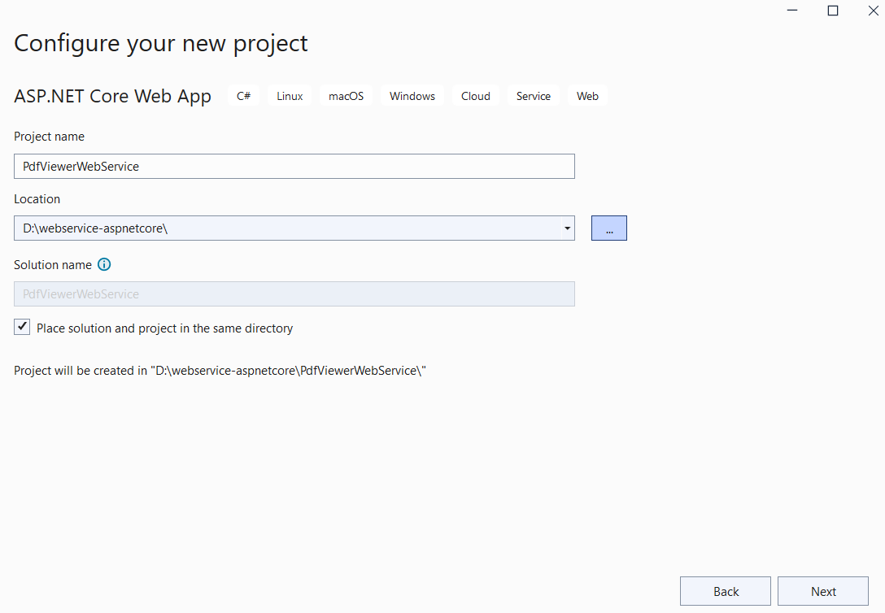
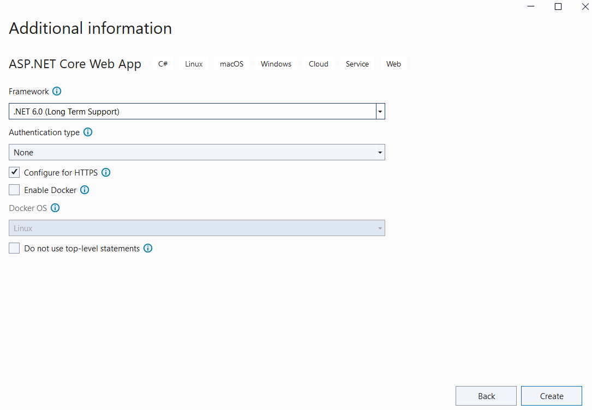
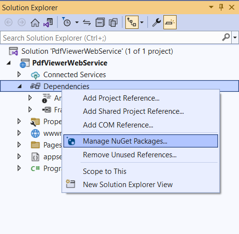
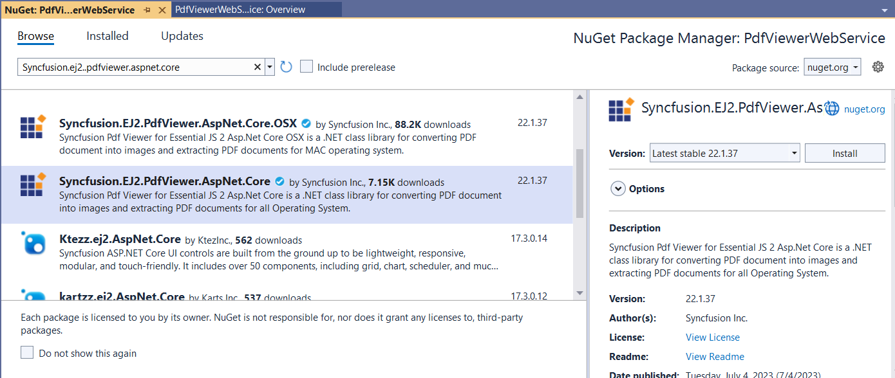
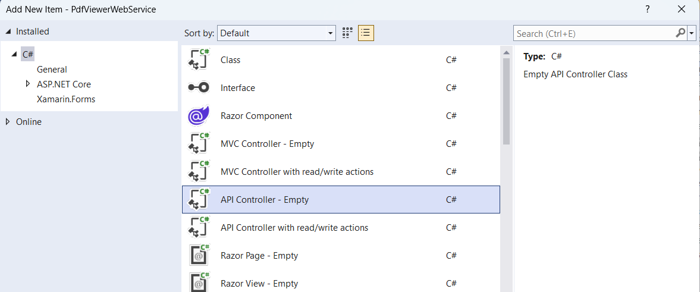

# Create pdfviewer service in ##Platform_Name## Pdfviewer control

The Essential JavaScript PDF Viewer have server side dependency to get the details from PDF Documents for rendering. This section explains how to create the service for PDF Viewer to perform server-side preprocessing of the PDF document to be rendered in client side.

## Prerequisites

To get started with ASP.NET CORE Web API service, refer [System requirements for ASP.NET Core controls](https://ej2.syncfusion.com/aspnetcore/documentation/system-requirements).

## Setup ASP.NET CORE application with Web API for PDF Viewer service

The following steps are used to create PDF Viewer service

**Step 1:**  Select File > New > Project, in the Visual Studio menu bar.



**Step 2:** Select ASP.NET Core Web Application and then click **Next**.



**Step 3:** In the Configure your new project dialog, enter Project Name and select **Next**.



**Step 4:** In the Additional information dialog, select .NET 6.0 (Long-term Support) and then select **Create**.



**Step 5:** After creating the project, add the [Syncfusion.EJ2.PdfViewer.AspNet.Core](https://www.nuget.org/packages/Syncfusion.EJ2.PdfViewer.AspNet.Core) dependency to your project by using 'NuGet Package Manager'.

Open the `NuGet` package manager.


Install the **Syncfusion.EJ2.PdfViewer.AspNet.Core** package to the application.



**Step 6:** Add the API Controller to the project and named it as `PdfViewerController` .


**Step 7:** Add the following code to the `PdfViewerController.cs` controller.

```ts
using Microsoft.AspNetCore.Hosting;
using Microsoft.AspNetCore.Mvc;
using Microsoft.Extensions.Caching.Memory;
using Newtonsoft.Json;
using Syncfusion.EJ2.PdfViewer;
using System;
using System.Collections.Generic;
using System.IO;
using System.Net;

namespace PdfViewerWebService
{
    [Route("[controller]")]
    [ApiController]
    public class PdfViewerController : ControllerBase
    {
        private IWebHostEnvironment _hostingEnvironment;
        //Initialize the memory cache object   
        public IMemoryCache _cache;
        public PdfViewerController(IWebHostEnvironment hostingEnvironment, IMemoryCache cache)
        {
            _hostingEnvironment = hostingEnvironment;
            _cache = cache;
            Console.WriteLine("PdfViewerController initialized");
        }

        [HttpPost("Load")]
        [Microsoft.AspNetCore.Cors.EnableCors("MyPolicy")]
        [Route("[controller]/Load")]
        //Post action for Loading the PDF documents   
        public IActionResult Load([FromBody] Dictionary<string, string> jsonObject)
        {
            Console.WriteLine("Load called");
            //Initialize the PDF viewer object with memory cache object
            PdfRenderer pdfviewer = new PdfRenderer(_cache);
            MemoryStream stream = new MemoryStream();
            object jsonResult = new object();
            if (jsonObject != null && jsonObject.ContainsKey("document"))
            {
                if (bool.Parse(jsonObject["isFileName"]))
                {
                    string documentPath = GetDocumentPath(jsonObject["document"]);
                    if (!string.IsNullOrEmpty(documentPath))
                    {
                        byte[] bytes = System.IO.File.ReadAllBytes(documentPath);
                        stream = new MemoryStream(bytes);
                    }
                    else
                    {
                        string fileName = jsonObject["document"].Split(new string[] { "://" }, StringSplitOptions.None)[0];

                        if (fileName == "http" || fileName == "https")
                        {
                            WebClient WebClient = new WebClient();
                            byte[] pdfDoc = WebClient.DownloadData(jsonObject["document"]);
                            stream = new MemoryStream(pdfDoc);
                        }

                        else
                        {
                            return this.Content(jsonObject["document"] + " is not found");
                        }
                    }
                }
                else
                {
                    byte[] bytes = Convert.FromBase64String(jsonObject["document"]);
                    stream = new MemoryStream(bytes);
                }
            }
            jsonResult = pdfviewer.Load(stream, jsonObject);
            return Content(JsonConvert.SerializeObject(jsonResult));
        }

        [AcceptVerbs("Post")]
        [HttpPost("Bookmarks")]
        [Microsoft.AspNetCore.Cors.EnableCors("MyPolicy")]
        [Route("[controller]/Bookmarks")]
        //Post action for processing the bookmarks from the PDF documents
        public IActionResult Bookmarks([FromBody] Dictionary<string, string> jsonObject)
        {
            //Initialize the PDF Viewer object with memory cache object
            PdfRenderer pdfviewer = new PdfRenderer(_cache);
            var jsonResult = pdfviewer.GetBookmarks(jsonObject);
            return Content(JsonConvert.SerializeObject(jsonResult));
        }

        [AcceptVerbs("Post")]
        [HttpPost("RenderPdfPages")]
        [Microsoft.AspNetCore.Cors.EnableCors("MyPolicy")]
        [Route("[controller]/RenderPdfPages")]
        //Post action for processing the PDF documents  
        public IActionResult RenderPdfPages([FromBody] Dictionary<string, string> jsonObject)
        {
            //Initialize the PDF Viewer object with memory cache object
            PdfRenderer pdfviewer = new PdfRenderer(_cache);
            object jsonResult = pdfviewer.GetPage(jsonObject);
            return Content(JsonConvert.SerializeObject(jsonResult));
        }

        [AcceptVerbs("Post")]
        [HttpPost("RenderPdfTexts")]
        [Microsoft.AspNetCore.Cors.EnableCors("MyPolicy")]
        [Route("[controller]/RenderPdfTexts")]
        //Post action for processing the PDF texts  
        public IActionResult RenderPdfTexts([FromBody] Dictionary<string, string> jsonObject)
        {
            //Initialize the PDF Viewer object with memory cache object
            PdfRenderer pdfviewer = new PdfRenderer(_cache);
            object jsonResult = pdfviewer.GetDocumentText(jsonObject);
            return Content(JsonConvert.SerializeObject(jsonResult));
        }

        [AcceptVerbs("Post")]
        [HttpPost("RenderThumbnailImages")]
        [Microsoft.AspNetCore.Cors.EnableCors("MyPolicy")]
        [Route("[controller]/RenderThumbnailImages")]
        //Post action for rendering the ThumbnailImages
        public IActionResult RenderThumbnailImages([FromBody] Dictionary<string, string> jsonObject)
        {
            //Initialize the PDF Viewer object with memory cache object
            PdfRenderer pdfviewer = new PdfRenderer(_cache);
            object result = pdfviewer.GetThumbnailImages(jsonObject);
            return Content(JsonConvert.SerializeObject(result));
        }
        [AcceptVerbs("Post")]
        [HttpPost("RenderAnnotationComments")]
        [Microsoft.AspNetCore.Cors.EnableCors("MyPolicy")]
        [Route("[controller]/RenderAnnotationComments")]
        //Post action for rendering the annotations
        public IActionResult RenderAnnotationComments([FromBody] Dictionary<string, string> jsonObject)
        {
            //Initialize the PDF Viewer object with memory cache object
            PdfRenderer pdfviewer = new PdfRenderer(_cache);
            object jsonResult = pdfviewer.GetAnnotationComments(jsonObject);
            return Content(JsonConvert.SerializeObject(jsonResult));
        }
        [AcceptVerbs("Post")]
        [HttpPost("ExportAnnotations")]
        [Microsoft.AspNetCore.Cors.EnableCors("MyPolicy")]
        [Route("[controller]/ExportAnnotations")]
        //Post action to export annotations
        public IActionResult ExportAnnotations([FromBody] Dictionary<string, string> jsonObject)
        {
            PdfRenderer pdfviewer = new PdfRenderer(_cache);
            string jsonResult = pdfviewer.ExportAnnotation(jsonObject);
            return Content(jsonResult);
        }
        [AcceptVerbs("Post")]
        [HttpPost("ImportAnnotations")]
        [Microsoft.AspNetCore.Cors.EnableCors("MyPolicy")]
        [Route("[controller]/ImportAnnotations")]
        //Post action to import annotations
        public IActionResult ImportAnnotations([FromBody] Dictionary<string, string> jsonObject)
        {
            PdfRenderer pdfviewer = new PdfRenderer(_cache);
            string jsonResult = string.Empty;
            object JsonResult;
            if (jsonObject != null && jsonObject.ContainsKey("fileName"))
            {
                string documentPath = GetDocumentPath(jsonObject["fileName"]);
                if (!string.IsNullOrEmpty(documentPath))
                {
                    jsonResult = System.IO.File.ReadAllText(documentPath);
                }
                else
                {
                    return this.Content(jsonObject["document"] + " is not found");
                }
            }
            else
            {
                string extension = Path.GetExtension(jsonObject["importedData"]);
                if (extension != ".xfdf")
                {
                    JsonResult = pdfviewer.ImportAnnotation(jsonObject);
                    return Content(JsonConvert.SerializeObject(JsonResult));
                }
                else
                {
                    string documentPath = GetDocumentPath(jsonObject["importedData"]);
                    if (!string.IsNullOrEmpty(documentPath))
                    {
                        byte[] bytes = System.IO.File.ReadAllBytes(documentPath);
                        jsonObject["importedData"] = Convert.ToBase64String(bytes);
                        JsonResult = pdfviewer.ImportAnnotation(jsonObject);
                        return Content(JsonConvert.SerializeObject(JsonResult));
                    }
                    else
                    {
                        return this.Content(jsonObject["document"] + " is not found");
                    }
                }
            }
            return Content(jsonResult);
        }

        [AcceptVerbs("Post")]
        [HttpPost("ExportFormFields")]
        [Microsoft.AspNetCore.Cors.EnableCors("MyPolicy")]
        [Route("[controller]/ExportFormFields")]
        public IActionResult ExportFormFields([FromBody] Dictionary<string, string> jsonObject)

        {
            PdfRenderer pdfviewer = new PdfRenderer(_cache);
            string jsonResult = pdfviewer.ExportFormFields(jsonObject);
            return Content(jsonResult);
        }

        [AcceptVerbs("Post")]
        [HttpPost("ImportFormFields")]
        [Microsoft.AspNetCore.Cors.EnableCors("MyPolicy")]
        [Route("[controller]/ImportFormFields")]
        public IActionResult ImportFormFields([FromBody] Dictionary<string, string> jsonObject)
        {
            PdfRenderer pdfviewer = new PdfRenderer(_cache);
            jsonObject["data"] = GetDocumentPath(jsonObject["data"]);
            object jsonResult = pdfviewer.ImportFormFields(jsonObject);
            return Content(JsonConvert.SerializeObject(jsonResult));
        }

        [AcceptVerbs("Post")]
        [HttpPost("Unload")]
        [Microsoft.AspNetCore.Cors.EnableCors("MyPolicy")]
        [Route("[controller]/Unload")]
        //Post action for unloading and disposing the PDF document resources  
        public IActionResult Unload([FromBody] Dictionary<string, string> jsonObject)
        {
            //Initialize the PDF Viewer object with memory cache object
            PdfRenderer pdfviewer = new PdfRenderer(_cache);
            pdfviewer.ClearCache(jsonObject);
            return this.Content("Document cache is cleared");
        }


        [HttpPost("Download")]
        [Microsoft.AspNetCore.Cors.EnableCors("MyPolicy")]
        [Route("[controller]/Download")]
        //Post action for downloading the PDF documents
        public IActionResult Download([FromBody] Dictionary<string, string> jsonObject)
        {
            //Initialize the PDF Viewer object with memory cache object
            PdfRenderer pdfviewer = new PdfRenderer(_cache);
            string documentBase = pdfviewer.GetDocumentAsBase64(jsonObject);
            return Content(documentBase);
        }

        [HttpPost("PrintImages")]
        [Microsoft.AspNetCore.Cors.EnableCors("MyPolicy")]
        [Route("[controller]/PrintImages")]
        //Post action for printing the PDF documents
        public IActionResult PrintImages([FromBody] Dictionary<string, string> jsonObject)
        {
            //Initialize the PDF Viewer object with memory cache object
            PdfRenderer pdfviewer = new PdfRenderer(_cache);
            object pageImage = pdfviewer.GetPrintImage(jsonObject);
            return Content(JsonConvert.SerializeObject(pageImage));
        }

        //Gets the path of the PDF document
        private string GetDocumentPath(string document)
        {
            string documentPath = string.Empty;
            if (!System.IO.File.Exists(document))
            {
                var path = _hostingEnvironment.ContentRootPath;
                if (System.IO.File.Exists(path + "/Data/" + document))
                    documentPath = path + "/Data/" + document;
            }
            else
            {
                documentPath = document;
            }
            Console.WriteLine(documentPath);
            return documentPath;
        }
        // GET api/values
        [HttpGet]
        public IEnumerable<string> Get()
        {
            return new string[] { "value1", "value2" };
        }

        // GET api/values/5
        [HttpGet("{id}")]
        public string Get(int id)
        {
            return "value";
        }
    }
}

```

**Step 8:** Change the launchUrl to pdfviewer (name of the controller) in the lauchSettings.json as follows.

```json
{
  "iisSettings": {
    "windowsAuthentication": false,
    "anonymousAuthentication": true,
    "iisExpress": {
      "applicationUrl": "http://localhost:2270",
      "sslPort": 44396
    }
  },
  "profiles": {
    "PdfViewerWebService": {
      "commandName": "Project",
      "dotnetRunMessages": true,
      "launchBrowser": true,
      "launchUrl": "pdfviewer",
      "applicationUrl": "https://localhost:7255;http://localhost:5262",
      "environmentVariables": {
        "ASPNETCORE_ENVIRONMENT": "Development"
      }
    },
    "IIS Express": {
      "commandName": "IISExpress",
      "launchBrowser": true,
      "launchUrl": "pdfviewer",
      "environmentVariables": {
        "ASPNETCORE_ENVIRONMENT": "Development"
      }
    }
  }
}
```

**Step 9:** Configuring CORS policy and add Newtonsoft.Json for JSON format support
* Browser security prevents a webpage from making requests to a different domain than the one that served the webpage. This restriction is called the same-origin policy. Cross Origin Resource Sharing (CORS) allows a server to relax the same-origin policy. Using CORS, a server can explicitly allow some cross-origin. Configure a CORS policy at application Startup.ConfigureServices.
* Prior to ASP.NET Core 3.0, the default JSON formatters implemented using the Newtonsoft.Json package. In ASP.NET Core 3.0 or later, the default JSON formatters are based on System.Text.Json. Support for Newtonsoft.Json based formatters and features is available by installing the Microsoft.AspNetCore.Mvc.NewtonsoftJson NuGet package and configuring it in Startup.ConfigureServices.

```cs
using Microsoft.AspNetCore.ResponseCompression;
using Newtonsoft.Json.Serialization;

var builder = WebApplication.CreateBuilder(args);
var MyAllowSpecificOrigins = "MyPolicy";
builder.Services.AddControllers().AddNewtonsoftJson(options =>
{
    // Use the default property (Pascal) casing
    options.SerializerSettings.ContractResolver = new DefaultContractResolver();
});
builder.Services.AddCors(options =>
{
    options.AddPolicy(name: MyAllowSpecificOrigins,
                        builder => {
                            builder.AllowAnyOrigin()
                              .AllowAnyMethod()
                              .AllowAnyHeader();
                        });
});

builder.Services.AddMemoryCache();
builder.Services.AddEndpointsApiExplorer();

builder.Services.Configure<GzipCompressionProviderOptions>(options => options.Level = System.IO.Compression.CompressionLevel.Optimal);
builder.Services.AddResponseCompression();

var app = builder.Build();

//Register Syncfusion license
string licenseKey = string.Empty;
Syncfusion.Licensing.SyncfusionLicenseProvider.RegisterLicense(licenseKey);

app.UseHttpsRedirection();
app.UseCors(MyAllowSpecificOrigins);
app.UseAuthorization();

app.UseResponseCompression();
app.MapControllers();

app.Run();
```

View the sample in GitHub to [create PDF Viewer web service](https://github.com/SyncfusionExamples/EJ2-PDFViewer-WebServices/tree/main/ASP.NET%20Core/PdfViewerWebService_6.0)