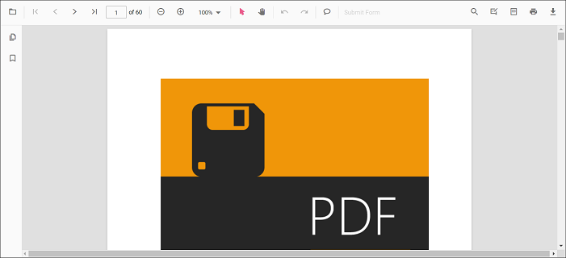

# Use local script and style references in ##Platform_Name## Pdfviewer control

**Step 1:** Create an app folder `myapp` for Essential JS 2 JavaScript components.

**Step 2:** You can get the global scripts and styles from the [Essential Studio JavaScript (Essential JS 2)](https://www.syncfusion.com/downloads/essential-js2/) build installed location.

**Syntax:**
> Script: `**(installed location)**/Syncfusion/Essential Studio/JavaScript - EJ2/{RELEASE_VERSION}/Web(Essential JS 2)/JavaScript/{PACKAGE_NAME}/dist/{PACKAGE_NAME}.min.js`
>
> Styles: `**(installed location)**/Syncfusion/Essential Studio/JavaScript - EJ2/{RELEASE_VERSION}/Web(Essential JS 2)/JavaScript/{PACKAGE_NAME}/styles/material.css`

**Example:**
> Script: `C:/Program Files (x86)/Syncfusion/Essential Studio/JavaScript - EJ2/19.3.53/Web(Essential JS 2)/JavaScript/ej2/dist/ej2.min.js`
>
> Styles: `C:/Program Files (x86)/Syncfusion/Essential Studio/JavaScript - EJ2/19.3.53/Web(Essential JS 2)/JavaScript/ej2-js-es5/styles/material.css`

You can also clone the [`Essential JS 2 quickstart`](https://github.com/syncfusion/ej2-quickstart.git) project and install necessary packages by using the following commands.

```
git clone https://github.com/syncfusion/ej2-quickstart.git quickstart
cd quickstart
npm install
```

**Step 3:** Create a folder `myapp/resources` and copy/paste the scripts and styles of ej2 package from the above installed location to `myapp/resources` location.

**Step 4:** Add the `Div` element and initiate the `Essential JS 2 PDF Viewer` component with script and style references in the `index.html` by using following code

```html
<!DOCTYPE html>
  <html xmlns="http://www.w3.org/1999/xhtml">
       <head>
          <title>Essential JS 2</title>
          <!-- Essential JS 2 material theme -->
          <link href="resources/ej2-js-es5/styles/material.css" rel="stylesheet" type="text/css"/>

          <!-- Essential JS 2 PDF Viewer's script -->
          <script src="resources/ej2.min.js" type="text/javascript"></script>
       </head>
       <body>
          <!--element which is going to render-->
          <div id="container">
               <div id="PdfViewer" style="display:block;height:580px;width:100%;">
               </div>
          </div>
          <script>
               //Initialize PDF Viewer component
               var pdfviewer = new ej.pdfviewer.PdfViewer({
                    documentPath: "https://cdn.syncfusion.com/content/pdf/pdf-succinctly.pdf",
                    serviceUrl: 'https://ej2services.syncfusion.com/production/web-services/api/pdfviewer'
               });
               //PDF Viewer control rendering starts
               pdfviewer.appendTo('#PdfViewer');
          </script>
       </body>
  </html>
```

**Step 6:** Now, run the `index.html` in web browser, it will render the **Essential JS 2 PDF Viewer** component as below.

